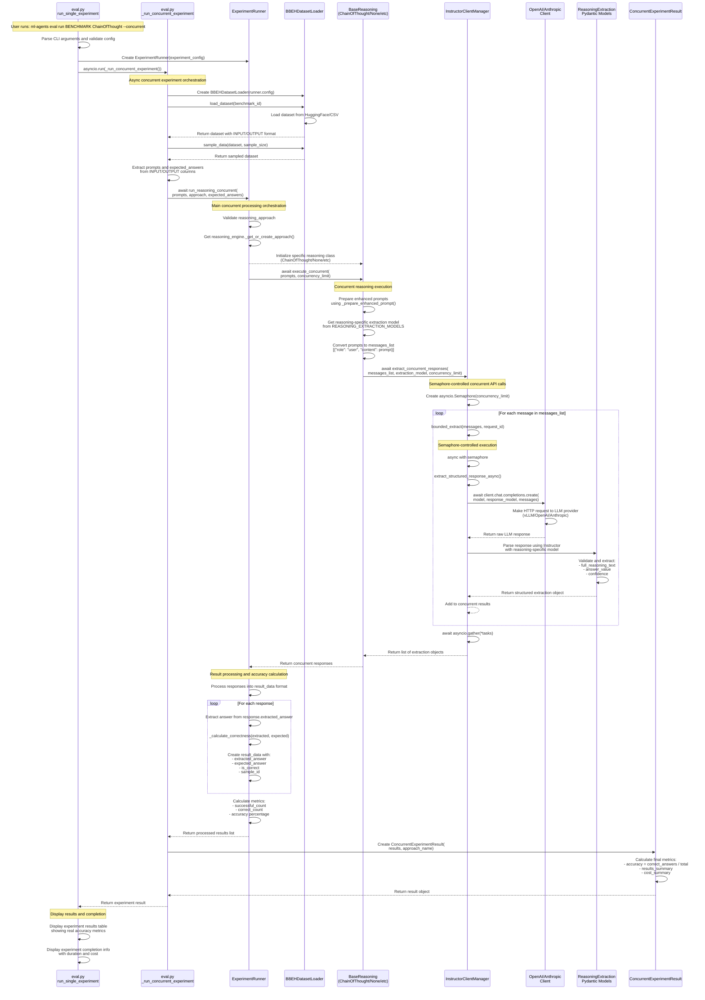

# Concurrent Evaluation Sequence Flow

This document provides a comprehensive sequence flow diagram for the ML Agents concurrent evaluation system, showing the interaction between all major classes during concurrent benchmark processing.

## Overview

The concurrent evaluation system processes multiple prompts simultaneously using async/await patterns and semaphore-based concurrency limiting. The system transforms benchmark datasets, applies reasoning approaches, makes concurrent API calls to LLM providers, extracts structured responses, and calculates accurate performance metrics.

## Complete Sequence Flow

## Key Components

### 1. CLI Layer (`eval.py`)
- **Entry Point**: `run_single_experiment()` - Handles command parsing and orchestration
- **Concurrent Orchestrator**: `_run_concurrent_experiment()` - Async function managing the complete concurrent flow

### 2. Dataset Management (`BBEHDatasetLoader`)
- **Data Loading**: Loads benchmarks from HuggingFace Hub or local CSV files
- **Sampling**: Applies sample size limits as specified by `--samples` parameter
- **Format Standardization**: Ensures INPUT/OUTPUT column format for consistent processing

### 3. Experiment Orchestration (`ExperimentRunner`)
- **Process Coordination**: `run_reasoning_concurrent()` - Main async method coordinating concurrent execution
- **Reasoning Engine Management**: Creates and manages reasoning approach instances
- **Result Processing**: Handles response processing, accuracy calculation, and result compilation

### 4. Reasoning Layer (`BaseReasoning` + Subclasses)
- **Approach-Specific Logic**: Each reasoning class (ChainOfThought, None, etc.) implements specific prompt enhancement
- **Concurrent Execution**: `execute_concurrent()` - Manages prompt preparation and concurrent API calls
- **Prompt Enhancement**: `_prepare_enhanced_prompt()` - Adds reasoning-specific instructions to prompts

### 5. Client Management (`InstructorClientManager`)
- **Provider Abstraction**: Handles different LLM providers (OpenAI, Anthropic, Cohere, local-openai)
- **Concurrent Control**: Uses asyncio.Semaphore to limit concurrent API requests
- **Structured Extraction**: Integrates with Instructor library for reliable response parsing

### 6. Structured Extraction (Pydantic Models)
- **Response Parsing**: Reasoning-specific Pydantic models extract structured data from LLM responses
- **Data Validation**: Ensures consistent format with `answer_value`, `full_reasoning_text`, `confidence`
- **Compatibility**: Provides `extracted_answer` property for backward compatibility

### 7. Result Processing (`ConcurrentExperimentResult`)
- **Metrics Calculation**: Computes accurate accuracy by comparing extracted vs expected answers
- **Result Compilation**: Aggregates individual results into experiment summary
- **Performance Tracking**: Tracks timing, costs, and success rates

## Flow Highlights

### Concurrent Processing
- Uses `asyncio.Semaphore` to limit concurrent requests (default: 10)
- Each API request is bounded by semaphore to prevent overwhelming the LLM provider
- Concurrent operations are gathered using `asyncio.gather()` for parallel execution

### Accuracy Calculation
- **Fixed Issue**: No longer uses placeholder 100% accuracy
- **Real Comparison**: Compares `extracted_answer` vs `expected_answer` using case-insensitive matching
- **Realistic Metrics**: Shows actual model performance on challenging benchmarks like GPQA

### Error Handling
- Graceful handling of API failures with None returns
- Partial results support - failed requests don't stop the entire experiment
- Comprehensive logging for debugging concurrent operations

### Data Flow
1. **Dataset** → INPUT/OUTPUT format standardization
2. **Prompts** → Reasoning-specific enhancement
3. **API Calls** → Concurrent execution with semaphore limiting
4. **Responses** → Structured extraction using Pydantic models
5. **Results** → Accuracy calculation and metric compilation

This architecture enables efficient, scalable evaluation of reasoning approaches across large benchmarks while maintaining accuracy and reliability.
